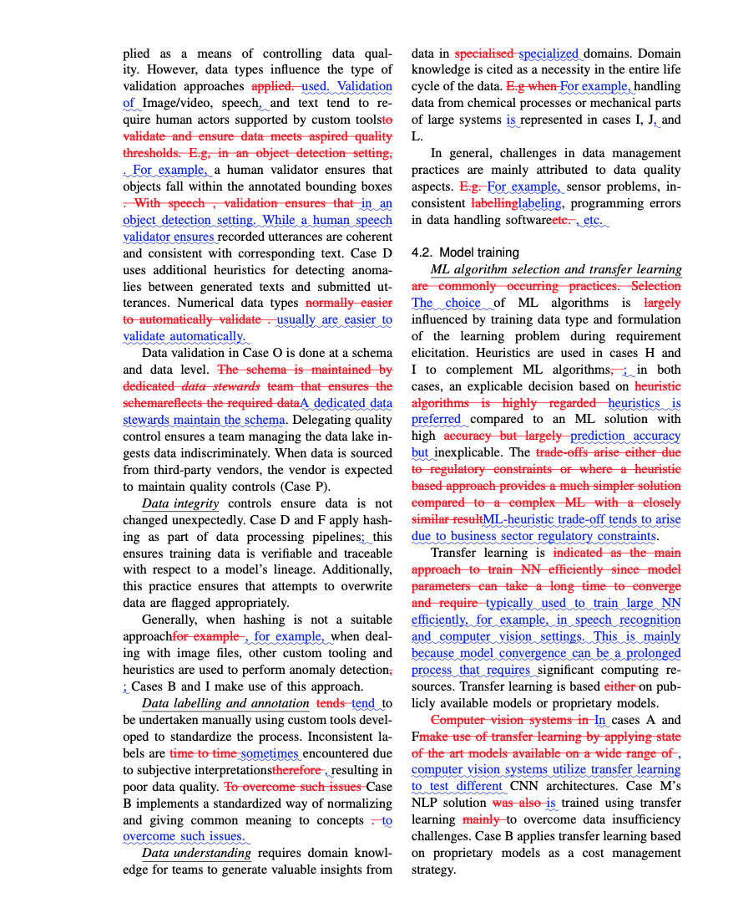

# Overview
This project is used to track changes between versions of a manuscript.

A python script is implemented to wrap main diff tool since our
project is structured as multiple latex files.

Instructions for basic usage can be found from overleaf's
[documentation](https://www.overleaf.com/learn/latex/Articles/Using_Latexdiff_For_Marking_Changes_To_Tex_Documents).

## Latexdiff

The main tool used to track changes in latex is
[latexdiff](https://www.ctan.org/tex-archive/support/latexdiff) which
is a perl script and found in CTAN repositories.

## Running the script
Run the command below from the latex_diff root folder.
The manuscript folder contains three folders:
- An earlier verion of the manuscript (mlopsv1)
- A newer version of the manuscript (mlopsv2)
- A folder containging the resulting changes (mlopsdiff)

PS:Only the **sections** and **tables** folders of the manuscript are
currently tracked. Images folder is not tracked
Other files are tracked on a need basis.

```python
python checkfiles.py
```
## Workflow Instructions
- Working directory is `latex_diff` or the directory where the project is cloned.
- Download the revised version `v2` of the manuscript from from overleaf, the downloaded file is usually a zip file.
- Unzip the obtained file
  `unzip mlopsv2.zip -d manuscript/mlopsv2`
- Run the script that checks for diffs
  `python checkfiles.py`
- Zip the resulting files containing Latexdiff's markdown
  `zip -vr mlopsdiff.zip mlopsdiff/ -x "*.DS_Store"`
- Upload the resulting zip file to overleaf
  New Project -> Upload project -> Select a .zip file

Overleaf will unpack the file and compile the project.

The resulting pdf will show the changes as shown in figure below

