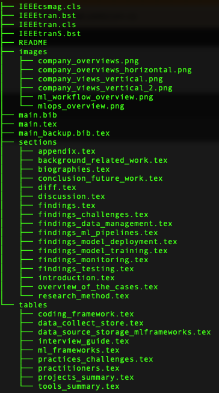

# Overview
This project is used to track changes between versions of a manuscript.

A python script is implemented to wrap main diff tool since our
project is structured as multiple latex files.

Instructions for basic usage can be found from overleaf's
[documentation](https://www.overleaf.com/learn/latex/Articles/Using_Latexdiff_For_Marking_Changes_To_Tex_Documents).

## Latexdiff

The main tool used to track changes in latex is
[latexdiff](https://www.ctan.org/tex-archive/support/latexdiff) which
is a perl script and found in CTAN repositories.

## Running the script
Run the command below from the latex_diff root folder.
The manuscript folder contains three folders:
- An earlier verion of the manuscript (mlopsv1)
- A newer version of the manuscript (mlopsv2)
- A folder containging the resulting changes (mlopsdiff)

PS:Only the **sections** and **tables** folders of the manuscript are
currently tracked. Images folder is not tracked
Other files are tracked on a need basis.

```python
python checkfiles.py
```
## Workflow Instructions
- Working directory is `latex_diff` or the directory where the project is cloned.
- Download the revised version `v2` of the manuscript from from overleaf, the downloaded file is usually a zip file.
- Unzip the obtained file
  ```
  unzip v2.zip -d manuscript/mlopsv2
  ```
- Run the script that checks for diffs
  ```
  python checkfiles.py
  ```
- Zip the resulting files containing Latexdiff's markdown
  ```
  zip -vr mlopsdiff.zip mlopsdiff/ -x "*.DS_Store"
  ```
- Upload the resulting zip file to overleaf
  ```
  New Project -> Upload project -> Select a .zip file
  ```

Overleaf will unpack the file and compile the project.

The resulting pdf will show the changes as shown in figure below


## latexexpand

This tool was used to consolidate all the file structure used during
the development of the manuscript 

```
├── IEEEcsmag.cls
├── IEEEtran.bst
├── IEEEtran.cls
├── IEEEtranS.bst
├── README
├── images
│   ├── company_overviews.png
│   ├── company_overviews_horizontal.png
│   ├── company_views_vertical.png
│   ├── company_views_vertical_2.png
│   ├── ml_workflow_overview.png
│   └── mlops_overview.png
├── latexpand
│   ├── LICENCE
│   ├── README
│   ├── latexpand
│   └── version.txt
├── main.bib
├── main.tex
├── main_backup.bib.tex
├── sections
│   ├── appendix.tex
│   ├── background_related_work.tex
│   ├── biographies.tex
│   ├── conclusion_future_work.tex
│   ├── diff.tex
│   ├── discussion.tex
│   ├── findings.tex
│   ├── findings_challenges.tex
│   ├── findings_data_management.tex
│   ├── findings_ml_pipelines.tex
│   ├── findings_model_deployment.tex
│   ├── findings_model_training.tex
│   ├── findings_monitoring.tex
│   ├── findings_testing.tex
│   ├── introduction.tex
│   ├── overview_of_the_cases.tex
│   └── research_method.tex
└── tables
    ├── coding_framework.tex
    ├── data_collect_store.tex
    ├── data_source_storage_mlframeworks.tex
    ├── interview_guide.tex
    ├── ml_frameworks.tex
    ├── practices_challenges.tex
    ├── practitioners.tex
    ├── projects_summary.tex
    └── tools_summary.tex
```
The command shown below is used to extract the generate the file. More
details on running the tool can be found on it's README file

```
latexpand/.latexpand main.tex --biber main.bib > main_flattened.tex
```

The files are then zipped into one project file which is then uploaded
to overleaf for latex parsing. The IEEE files contain the necessary
styling config

```
zip -vr main_flattened.zip main_flattened.tex IEEE* *.bib
```

The resulting zip file contains the following files
```bash
mlops_v4_flattened $ unzip -l main_flattened.zip 
Archive:  main_flattened.zip
  Length      Date    Time    Name
---------  ---------- -----   ----
    48526  03-18-2022 14:38   main_flattened.tex
   209203  03-18-2022 10:55   IEEEcsmag.cls
    59215  03-18-2022 10:55   IEEEtran.bst
   281957  03-18-2022 10:55   IEEEtran.cls
    62786  03-18-2022 10:55   IEEEtranS.bst
     5383  03-18-2022 10:55   main.bib
---------                     -------
```